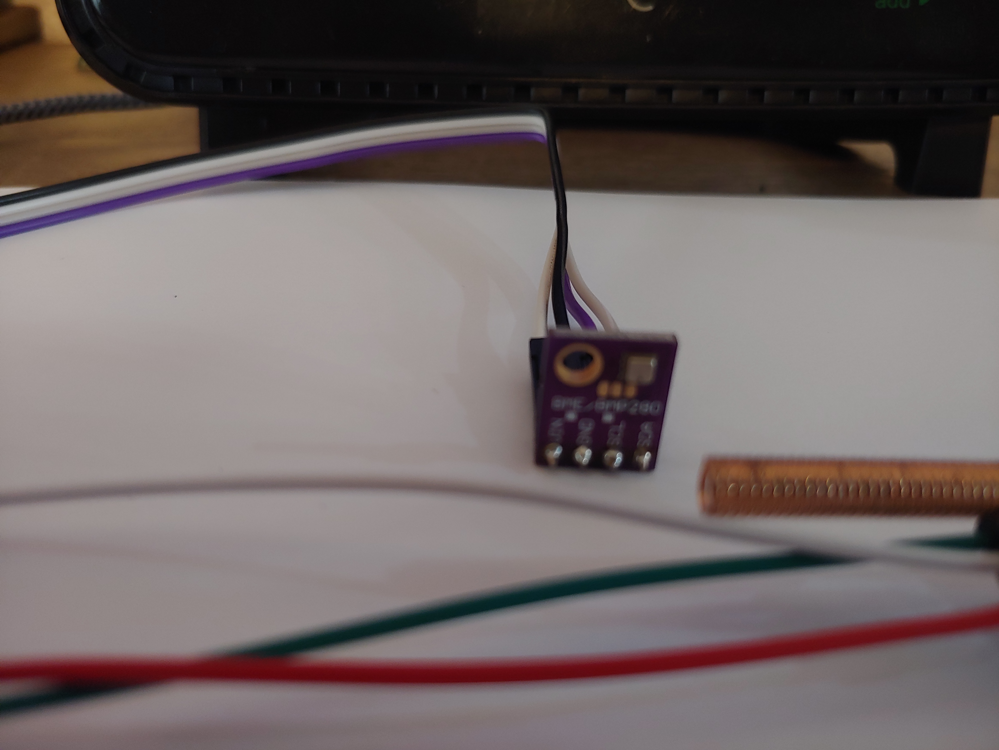

# M5Stack weather-station

Weather Station built with Rust using std threads, wifi, sntp, and crossbeam channels.

## Parts
- Acurite5n1 weather sensor
- BME280 I2C sensor
- SYN480R Module - 433.92MHz receiver with a 17cm 22AWG wire antenna

## Overview
This application shows how to use Rust and variouss crates to display outdoor weather data from the Acurite5n1
weather station and indoor weather data from the BME280 sensor.

## Views
The following views are dsiplayed by this application.
- Indoor/Outdoor View - displays indoor or outdoor weather data
- Wind/Rain/Status View - displays outdoor wind data, outdoor rain data and acurite5n1 sensor satatus
- Time and Date - display the current time (MST) and current date

## A view
A view consists of a content pane and a navigation pane. The content pane varies depending upon the view 
selected and the naviagtion pane is at the bottom of the screen where the 3 hardware buttons on the M5Stack are located.  
Two or three menu buttons are supported "NEXT" and "PREV" and "SET. The SET button has not been implemented yet and may be
used to set the time and the date.

## Hardware buttons
The three pushbuttons are debounced in software and when pushed and released cahnge the view of the display button.

## Threads
The app has 5 additional threads running besides the main thread. 
- user_buttons - A thread to debounce the hardware buttons.
- weather_station - A thread to handles weather data conversions and calculautions
- acurite5n1 - A thread that handles decoding the pulse stream from the SYN480R module, using an RMT receiver
- gui - A thread that handles gui / view presentation
- scheduler - a thread that calls other threads to perform tasks at certain time intervals

## Crossbeam channels
The application uses crossbem channels to communicate (transfer data and signal events) between threads.
- tx1 used by acurite5n1, rx1 used by weather_station - send weather data from acurite5n1 to weather_station
- tx2 used by weather_station, rx2 used by gui - send converted/calculated wether data to gui
- tx3 used by user_buttons, rx3 used by gui - send button pushd/released events to gui
- tx4 used by scheduler, rx4 used by gui - send scheduled time event to gui
- tx5 used by scheduler, rx5 used by weather_station - send scheduled time events to weathe_station

## Pictures of the various views
The Indoor/Outdoor View

The Wind/Rain/Status View

The Time and Date View

The 433.92MHz receiver - I tried many 433MHz receivers but this one worked best for me

The Indoor Sensor

# Versions
### v1.0 : 
- initial release
